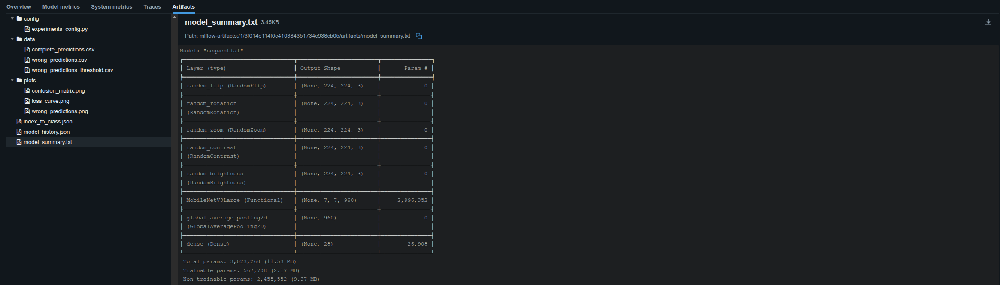
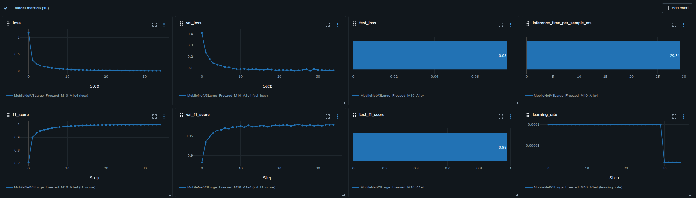

# RottenBot - Experiment Tracking

## 🎯 Overview

This repository provides a framework for training, evaluating, and tracking deep learning models for image classification. While the current implementation focuses on detecting healthy vs. rotten fruits and vegetables (28 classes) with TensorFlow/Keras, the architecture is designed to be easily extensible for:

- **PyTorch-based training pipelines**
- **Scikit-learn models**
- **Any ML task that benefits from MLflow tracking**

## ✨ Key Features

### Experiment Tracking & Reproducibility
- **Full reproducibility** through comprehensive seed management
- **Git SHA tracking** for code version control
- **Configuration versioning** - each run logs its `experiments_config.py`
- **Dataset versioning** via MLflow tags
- **Metrics tracking** including training, validation, and test performance
- **Model artifacts** for deployment readiness

### Training Best Practices
- ✅ **Transfer Learning** with MobileNetV3Large (freezable backbone)
- ✅ **Mixed Precision Training** (FP16) for faster training and reduced memory usage
- ✅ **Data Augmentation** in-model for robustness
- ✅ **Class Weighting** to handle imbalanced datasets
- ✅ **Training Callbacks** such as EarlyStopping and learning rate scheduling

### Comprehensive Evaluation
- Training history visualization (loss and metrics curves)
- Confusion matrix generation
- Prediction time benchmarking (ms per sample)
- CSV exports with all predictions and misclassifications
- Confidence-based filtering for model interpretation

## 🚀 Quick Start

### Prerequisites
- uv package manager (for dependency management)
- Docker & Docker Compose (for MLflow server)
- A dataset with images split into `train/`, `val/`, and `test/` folders. If you have a single folder of images, see Dataset Preparation below.

### Installation

1. **Clone the repository**
   ```bash
   git clone https://github.com/niels-2005/RottenBot_ExpTracking.git
   cd fruit_vege_disease
   ```

2. **Set up Python environment with uv**
   ```bash
   uv venv
   source .venv/bin/activate  # On Windows: .venv\Scripts\activate
   uv sync
   ```

3. **Start MLflow Server**
   ```bash
   docker-compose up -d
   ```
   
   The MLflow UI will be available at `http://localhost:5000`

### Dataset Preparation

If your dataset is not yet split into train/val/test folders:

1. **Configure the split** in `src/rotten_bot/split_folders.py`

2. **Run the split command**
   ```bash
   split-folders
   ```

### Running Experiments

1. **Create an MLflow Experiment** (first time only)
   
   Configure in `src/rotten_bot/create_experiment.py`:
   
   Then run:
   ```bash
   create-experiment
   ```

2. **Configure your experiment** in `src/rotten_bot/experiments_config.py`

3. **Run the experiment**
   ```bash
   run-experiment
   ```

4. **Monitor in MLflow UI**
   
   Navigate to `http://localhost:5000` to view- your experiments, metrics, and artifacts.

## 📊 What Gets Tracked?

For each experiment run, the following is automatically logged to MLflow:

### Metadata & Versioning
- ✅ Git commit SHA (for code reproducibility)
- ✅ Experiment configuration file (`experiments_config.py`)
- ✅ Dataset identifier (as tag)
- ✅ Run name and description

### Training Metrics
- ✅ Loss (training and validation), (`loss_curve.png`)
- ✅ Metrics (F1-score, accuracy, etc.)
- ✅ Learning rate progression
- ✅ Optional: System metrics (CPU, RAM, etc.)

### Model Artifacts
- ✅ Trained model (Keras format)
- ✅ Model Summary (`model_summary.txt`)
- ✅ Model History (`model_history.json`)
- ✅ Class index mapping (`index_to_class.json`)

### Evaluation Results
- ✅ Test set performance metrics
- ✅ Confusion matrix visualization (`confusion_matrix.png`)
- ✅ Prediction time statistics (ms per sample)
- ✅ Complete predictions CSV (all samples) (`complete_predictions.csv`)
- ✅ Misclassified samples CSV (`wrong_predictions.csv`)
- ✅ High-confidence misclassifications CSV (configurable threshold) (`wrong_predictions_threshold.csv`)

## See below for an example of logged artifacts and Training Metrics:

### Logged Artifacts Example



### Training Metrics Example



### Model Performance Analysis

Looking at the training metrics, the model shows slight overfitting. The training loss approaches ~0 while the validation loss stabilizes around 0.08, with the test loss also at 0.08. This gap suggests the model has learned the training data very well but generalizes with a small performance decrease.

**Potential improvements to reduce overfitting:**
- Add **Dropout layers** (e.g., 0.3-0.5 dropout rate before the final dense layer)
- Increase **data augmentation** intensity (stronger rotations, zoom ranges)
- Apply **L2 regularization** to dense layers
- Collect **more training data** to improve generalization
- Experiment with **different backbone freezing strategies** (freeze fewer layers)

**Inference Performance:**  
The model achieves **29.34 ms per sample** on NVIDIA GeForce RTX 4070 hardware - delivering lightning-fast inference with high accuracy! This makes it suitable for real-time applications.

**Further Speed Optimization:**  
To achieve even faster inference speeds, **model quantization** can be applied! Quantization techniques (e.g., TensorFlow Lite INT8 quantization or dynamic range quantization) can significantly reduce model size and improve inference speed, especially on edge devices. However, this may lead to slight accuracy degradation, so it's important to benchmark performance after quantization to ensure acceptable results.

## 🏗️ Architecture & Design

### Current Implementation

The framework uses **MobileNetV3Large** as the backbone for efficient training and inference:

- **Base Model**: MobileNetV3Large pre-trained on ImageNet
- **Freezing Strategy**: All layers frozen except the last 10
- **Custom Head**: Global Average Pooling + Dense(28, softmax)
- **Input Size**: 224×224×3
- **Precision**: Mixed FP16 for faster training
- **Data Augmentation**: Random flip, rotation, zoom, contrast, brightness

### Extensibility

The modular design allows easy extension to other frameworks and tasks.:

```
rotten_bot/
├── experiments_config.py     
├── run_experiment.py         
├── create_experiment.py     
├── split_folders.py          
└── utils/                    
    ├── ...                   
```

### Future Extensions

- Add Hyperparameter tuning support (e.g. Keras Tuner)
- Add Tensorflow Lite support for Edge Devices or Quantization
- Change `run_experiment.py` to `run_experiment_tf.py` and `experiments_config.py` to `experiments_config_tf.py` for tensorflow models
- Add `run_experiment_pytorch.py` and `experiments_config_pytorch.py` for PyTorch models
- Add `run_experiment_sklearn.py` and `experiments_config_sklearn.py` for traditional ML
- Extend to other tasks (object detection, segmentation, etc.)

## 📄 License

This project is licensed under the MIT License.

This README.md file was written by AI but strictly followed by human review and edits.